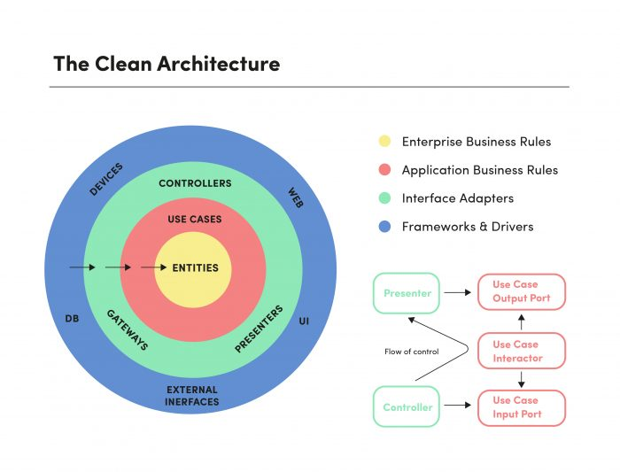

# 🧹 Clean Architecture Template

This project follows **Clean Architecture** principles, ensuring a codebase that is **testable, maintainable, and scalable** while adhering to **SOLID** principles.


---

## 📐 What is Clean Architecture?

Clean Architecture organizes code into concentric layers, similar to *The Onion Architecture*:

- **Inner layers** represent **high-level business policies** (domain logic)
- **Outer layers** represent **low-level technical details** (frameworks, databases, APIs)

This separation makes systems flexible, maintainable, and resistant to framework or infrastructure changes.

### The Dependency Rule

**Dependencies point inward only.** Outer layers can depend on inner layers, but inner layers never depend on outer layers.
```
main/ ──→ infrastructure/ ──→ application/ ──→ domain/
 🟣           🔵                 🔴             🟠

Outer layers depend on inner layers, never the reverse.
```

### 🎯 Conceptual View


🔗 [Read Uncle Bob's Clean Architecture](https://blog.cleancoder.com/uncle-bob/2012/08/13/the-clean-architecture.html)

---

## 🗂️ Project Structure

### Source Code Organization
```
src/
 ├── domain/                 # 🟠 Core Business Logic
 │   ├── entities/           # Business objects with identity and lifecycle
 │   ├── services/           # Domain operations and workflows
 │   └── value_objects/      # Immutable, identity-less values
 │
 ├── application/            # 🔴 Use Cases & Orchestration
 │   ├── interfaces/         # Port definitions (repositories, services)
 │   ├── use_cases/          # Business workflows and orchestration
 │   └── dtos/               # Data Transfer Objects for boundaries
 │
 ├── infrastructure/         # 🔵 Technical Implementation
 │   ├── repositories/       # Data persistence implementations (ORM, SQL, NoSQL)
 │   ├── external/           # Third-party services, APIs, messaging
 │   └── config/             # Framework setup, dependency injection
 │
 └── main/                   # 🟣 Entry Points & Delivery Mechanisms
     ├── controllers/        # HTTP/API request handlers
     ├── routes/             # Route definitions and middleware
     ├── presenters/         # Response formatting and view models
     ├── middleware/         # Authentication, logging, error handling
     └── cli/                # Command-line interface commands
```

### Test Organization
```
tests/
 ├── unit/                  # Fast, isolated tests for business logic
 ├── integration/           # Tests for layer interactions
 └── e2e/                   # End-to-end system tests
```

### Complete Architecture Diagram


---

## 🎯 Layer Responsibilities

### 🟠 Domain Layer: Core Business Logic
- **Zero dependencies** on other layers
- Contains entities, value objects, and domain services
- Pure business rules and validation
- Framework-agnostic and highly testable

[📖 View detailed documentation](./docs/domain-layer.md)

### 🔴 Application Layer: Use Cases & Orchestration
- Depends **only** on domain layer
- Defines interfaces (ports) for infrastructure
- Implements business workflows as use cases
- Coordinates domain objects to fulfill user stories

[📖 View detailed documentation](./docs/application-layer.md)

### 🔵 Infrastructure Layer: Technical Implementation
- Depends on application and domain layers
- Implements interfaces defined by application layer
- Handles databases, APIs, file systems, messaging
- Contains framework-specific code

[📖 View detailed documentation](./docs/infrastructure-layer.md)

### 🟣 Main Layer: Entry Points & Delivery
- Depends on all other layers
- Handles HTTP requests, CLI commands, events
- Thin controllers that delegate to use cases
- Formats responses for external consumers

[📖 View detailed documentation](./docs/main-layer.md)

---

## ✅ SOLID Principles in Practice

- **S** – Single Responsibility → Each class/module has one reason to change
- **O** – Open/Closed → Open for extension, closed for modification
- **L** – Liskov Substitution → Derived types must be substitutable for base types
- **I** – Interface Segregation → Keep interfaces small and focused
- **D** – Dependency Inversion → Depend on abstractions, not concretions

---

## 🧪 Testing Strategy
```
Unit Tests        → Test domain logic in isolation (fastest)
Integration Tests → Test layer interactions and data flow
E2E Tests         → Test complete user workflows (slowest)
```

The clean architecture makes testing easier by:
- Isolating business logic from technical details
- Allowing mock implementations of interfaces
- Enabling fast unit tests without databases or APIs

---

## 📚 References

### Essential Reading
- Uncle Bob – [The Clean Architecture](https://blog.cleancoder.com/uncle-bob/2012/08/13/the-clean-architecture.html)
- Bixlabs – [An Introduction to Clean Architecture](https://bixlabs.com/clean-architecture/)
- Martin Fowler – [Domain-Driven Design](https://martinfowler.com/bliki/DomainDrivenDesign.html)

### Additional Resources
- Jeffrey Palermo – [The Onion Architecture](https://jeffreypalermo.com/2008/07/the-onion-architecture-part-1/)
- Eric Evans – *Domain-Driven Design: Tackling Complexity in the Heart of Software*
- Robert C. Martin – *Clean Architecture: A Craftsman's Guide to Software Structure and Design*

---

## 🚀 Getting Started

1. **Understand the layers** – Read the layer-specific documentation
2. **Follow the dependency rule** – Inner layers never depend on outer layers
3. **Start with domain** – Define your entities and business rules first
4. **Define use cases** – Create application-layer workflows
5. **Implement infrastructure** – Build concrete implementations last
6. **Wire it together** – Use dependency injection in the main layer

---

## 📖 Additional Documentation

- [Domain Layer Guide](./docs/domain-layer.md)
- [Application Layer Guide](./docs/application-layer.md)
- [Infrastructure Layer Guide](./docs/infrastructure-layer.md)
- [Main Layer Guide](./docs/main-layer.md)